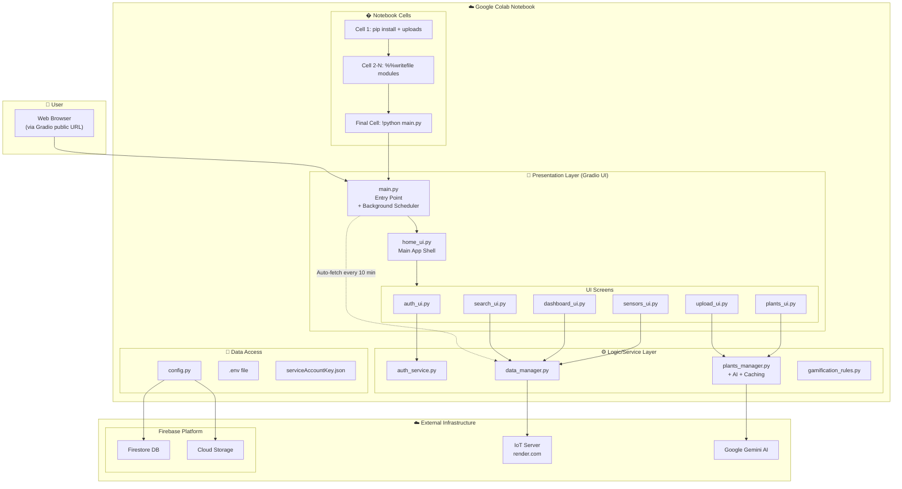

# 🌿 My Garden Care - Project Architecture

## System Overview

This document provides a comprehensive architecture diagram of the **My Garden Care** cloud-based plant management system, running from a **single Google Colab notebook**.

---

## Deployment Environment

| Component         | Details                                          |
| ----------------- | ------------------------------------------------ |
| **Runtime**       | Google Colab (Python 3.10+)                      |
| **Execution**     | Single Jupyter notebook with `%%writefile` cells |
| **Public Access** | Gradio's `share=True` generates public URL       |
| **Session**       | Ephemeral (files lost on runtime restart)        |

---

## Architecture Diagram



---

## Colab Notebook Structure

```python
# Cell 1: Setup
!pip install -q gradio firebase-admin google-generativeai python-dotenv nltk ...

# Cell 2: Upload required files
# - serviceAccountKey.json (Firebase credentials)
# - .env (API keys)
# - articles_data/*.txt (Knowledge base articles)

# Cells 3-N: Write module files
%%writefile config.py
# ... config code ...

%%writefile plants_manager.py
# ... plants_manager code ...

# ... more %%writefile cells for each module ...

# Final Cell: Run Application
!python main.py
```

---

## Layer Breakdown

### 🎨 Presentation Layer

| File                 | Purpose                                                                 |
| -------------------- | ----------------------------------------------------------------------- |
| `main.py`            | Entry point, background auto-fetcher, launches Gradio with `share=True` |
| `ui/home_ui.py`      | Main shell, navigation (hidden until login), vacation mode              |
| `ui/auth_ui.py`      | Login/Register with auto-clear                                          |
| `ui/plants_ui.py`    | Plant gallery with reactive loading                                     |
| `ui/sensors_ui.py`   | IoT sensor display with reactive dropdown                               |
| `ui/dashboard_ui.py` | Health charts with reactive controls                                    |
| `ui/upload_ui.py`    | Photo upload with auto-clear                                            |
| `ui/search_ui.py`    | RAG-powered knowledge search                                            |

### ⚙️ Logic/Service Layer

| File                    | Purpose                                            |
| ----------------------- | -------------------------------------------------- |
| `auth_service.py`       | Authentication, SHA-256 hashing, logout cleanup    |
| `plants_manager.py`     | Plant CRUD, **AI soil detection**, **TTL caching** |
| `data_manager.py`       | IoT sync, sensor history, **vacation report**, RAG |
| `gamification_rules.py` | Points, challenges, ranks                          |

### 💾 Data Access Layer

| File        | Purpose                                         |
| ----------- | ----------------------------------------------- |
| `config.py` | Firebase init, Firestore client, `.env` support |

---

## Key Features

| Feature                  | Implementation                                         |
| ------------------------ | ------------------------------------------------------ |
| 🤖 **AI Soil Detection** | Gemini AI determines optimal soil moisture per species |
| ⏰ **Auto-Fetcher**      | Background thread syncs IoT every 10 minutes           |
| ⚡ **TTL Caching**       | `list_plants()` cached for 60 seconds                  |
| 🔄 **Reactive UI**       | Dropdowns trigger immediate data refresh               |
| 🔐 **Login-First**       | Auth screen shown first, nav hidden until login        |

---

## Firestore Data Model

```
📁 users/{username}
    ├── display_name, email, password (hashed)
    ├── score, tasks_completed, challenge_state
    └── 📁 plants/{plant_id}
            └── name, species, image_url, min_soil, created_at

📁 sensors/{doc_id}
    └── plant_id, temp, humidity, soil, timestamp

📁 articles/{doc_id}
    └── title, content, url, metadata

📁 index/{term}
    └── doc_ids[], term
```

---

## Required Files (Upload to Colab)

| File                     | Description                             |
| ------------------------ | --------------------------------------- |
| `serviceAccountKey.json` | Firebase service account credentials    |
| `.env`                   | Contains `GOOGLE_API_KEY` for Gemini AI |
| `articles_data/*.txt`    | Knowledge base articles for RAG         |

---

## Environment Variables (`.env`)

```env
GOOGLE_API_KEY=your_gemini_api_key
FIREBASE_CREDENTIALS_PATH=./serviceAccountKey.json
```

---

## Technology Stack

| Category     | Technologies                         |
| ------------ | ------------------------------------ |
| **Runtime**  | Google Colab (Jupyter)               |
| **Frontend** | Gradio (Glass theme, `share=True`)   |
| **Backend**  | Python 3.10+                         |
| **Database** | Firebase Firestore                   |
| **Storage**  | Firebase Cloud Storage               |
| **AI**       | Google Gemini (gemini-2.0-flash)     |
| **NLP/RAG**  | SentenceTransformers, ChromaDB, NLTK |
| **IoT**      | External REST API (Render.com)       |
