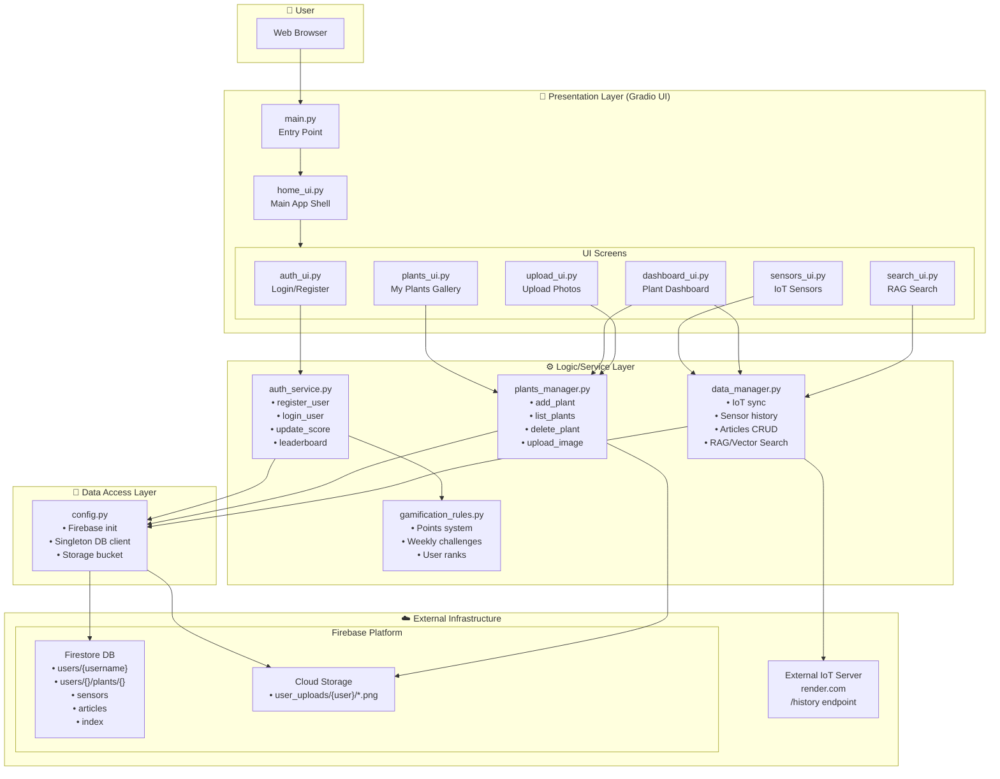

# 🌿 My Garden Care - Project Architecture

## System Overview

This document provides a comprehensive architecture diagram of the **My Garden Care** cloud-based plant management system.

---

## Architecture Diagram



---

## Layer Breakdown

### 🎨 Presentation Layer

| File              | Purpose                                                 |
| ----------------- | ------------------------------------------------------- |
| `main.py`         | Application entry point, initializes DB and launches UI |
| `home_ui.py`      | Main shell with navigation, logout, metrics overview    |
| `auth_ui.py`      | Login/Register forms                                    |
| `plants_ui.py`    | Gallery view of user's plants                           |
| `sensors_ui.py`   | IoT sensor data display                                 |
| `dashboard_ui.py` | Plant health dashboard with charts                      |
| `upload_ui.py`    | Photo upload interface                                  |
| `search_ui.py`    | RAG-powered knowledge base search                       |

### ⚙️ Logic/Service Layer

| File                    | Purpose                                                     |
| ----------------------- | ----------------------------------------------------------- |
| `auth_service.py`       | User authentication, password hashing, gamification scoring |
| `plants_manager.py`     | Plant CRUD operations, image upload to Cloud Storage        |
| `data_manager.py`       | IoT data sync, sensor history, articles, RAG vector search  |
| `gamification_rules.py` | Points definitions, weekly challenges, user ranks           |

### 💾 Data Access Layer

| File        | Purpose                                                               |
| ----------- | --------------------------------------------------------------------- |
| `config.py` | Firebase initialization (singleton), Firestore client, Storage bucket |

### ☁️ External Infrastructure

| Service           | Purpose                                                |
| ----------------- | ------------------------------------------------------ |
| **Firestore**     | Document database for users, plants, sensors, articles |
| **Cloud Storage** | Image storage for plant photos                         |
| **IoT Server**    | External sensor data source (Render.com)               |

---

## Data Flow Examples

### 1️⃣ User Registration

```
Browser → auth_ui.py → auth_service.register_user() → config.get_db() → Firestore (users collection)
```

### 2️⃣ Upload Plant Photo

```
Browser → upload_ui.py → plants_manager.add_plant_with_image() → Cloud Storage → Firestore (plants subcollection)
```

### 3️⃣ View Sensor Data

```
Browser → sensors_ui.py → data_manager.sync_iot_data() → IoT Server API → Firestore → sensors_ui.py → Browser
```

### 4️⃣ RAG Search

```
Browser → search_ui.py → data_manager.PlantRAG.query() → Vector Store + Articles → LLM/Template → Browser
```

---

## Firestore Data Model

```
📁 users/{username}
    ├── display_name, email, password (hashed)
    ├── score, tasks_completed
    ├── challenge_state
    └── 📁 plants/{plant_id}
            └── name, species, image_url, created_at

📁 sensors/{doc_id}
    └── plant_id, temp, humidity, soil, timestamp

📁 articles/{doc_id}
    └── title, content, url, metadata

📁 index/{term}
    └── doc_ids[], term
```
